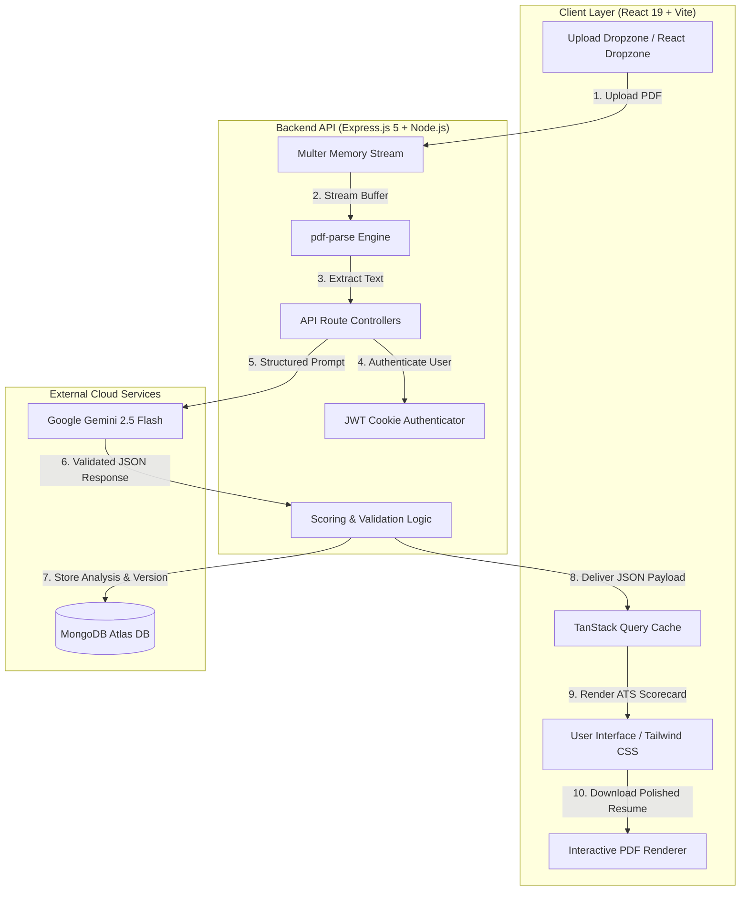

<div align="center">

# 📄 AI Resume Checker & ATS Optimizer
### *Enterprise AI-Powered Resume Parsing, Heuristic ATS Scoring & Real-Time Bullet Rewrites*

<br/>

<p align="center">
  <a href="https://skillicons.dev">
    
  </a>
</p>

<br/>

[](https://github.com)
[](https://github.com)
[](LICENSE)
[](https://aistudio.google.com/)
[](https://nodejs.org/)
[](https://www.mongodb.com/)

<br/>

[✨ Key Features](#-key-features) •
[🛠 Tech Stack Icon Packs](#-tech-stack-icon-packs) •
[🏗 Architecture](#-system-architecture) •
[📂 Project Directory](#-project-directory-structure) •
[🚀 Quick Start](#-quick-start--setup-guide) •
[⚙️ Environment Variables](#-environment-variables-reference) •
[📡 API Endpoints](#-api-endpoints-matrix) •
[🔮 Roadmap](#-future-roadmap)

---

</div>

## 🌟 Executive Summary

**AI Resume Checker** (also branded as *Resume Roaster*) is a full-stack developer tool and career optimization engine built to bridge the gap between job seekers and automated **Applicant Tracking Systems (ATS)**.

Industry data confirms that over **75% of submitted resumes are rejected by automated parsers** before a human recruiter ever sees them. This platform eliminates guesswork by:
1. Extracting raw, unstructured text from uploaded PDF resumes via server-side parsing.
2. Structuring complex resume trees (experience, education, achievements, links, skills) using **Google Gemini GenAI**.
3. Benchmarking content against a 4-dimensional ATS scoring algorithm.
4. Delivering instant, quantified bullet rewrites with strict metric justifications.
5. Providing full version history and dynamic PDF export directly from the client.

---

## 🛠 Tech Stack Icon Packs

<div align="center">

### 🎨 Complete Technology Ecosystem

<p align="center">
  
</p>

</div>

### 1. 🖥 Frontend Framework & UI Libraries

| Technology | Icon Badge | Version | Role in Project |
| :--- | :--- | :---: | :--- |
| **React** |  | `19.2.6` | Reactive component hierarchy, state hooks, and virtual DOM reconciliation |
| **Vite** |  | `8.0.12` | Next-generation ESM bundler and lightning-fast HMR development server |
| **Tailwind CSS** |  | `4.3.0` | Utility-first styling engine with theme variables and responsive primitives |
| **React Router** |  | `7.15.1` | Declarative client-side routing, protected auth layouts, and URL parameters |
| **TanStack Query** |  | `5.100.14` | Server-state caching, optimistic updates, and background refetching |
| **Framer Motion** |  | `12.40.0` | Fluid layout animations, entrance transitions, and micro-interactions |
| **Recharts** |  | `3.8.1` | Interactive ATS score evolution graphs, radial gauges, and keyword heatmaps |
| **Lucide Icons** |  | `1.17.0` | Crisp, scalable SVG UI icons across all dashboard actions |
| **React PDF** |  | `4.5.1` | Programmatic in-browser PDF generation, client previews, and resume downloads |
| **Axios** |  | `1.16.1` | Promise-based HTTP client with cookie interceptors and unified error handler |

<br/>

### 2. ⚙️ Backend Architecture & Database

| Technology | Icon Badge | Version | Role in Project |
| :--- | :--- | :---: | :--- |
| **Node.js** |  | `>=20.0` | Asynchronous JavaScript runtime powering the RESTful service engine |
| **Express.js** |  | `5.2.1` | Minimalist web application framework for routing, middleware, and controllers |
| **MongoDB Atlas** |  | Cloud M0 | Fully managed NoSQL cloud database storing users, resumes, versions, & scores |
| **Mongoose ODM** |  | `9.6.3` | Schema definition, model validation, query middleware, and connection pooling |
| **JWT** |  | `9.0.3` | Stateless authentication tokens transmitted over secure HTTP-only cookies |
| **Zod** |  | `4.4.3` | Strict runtime type inference and validation for all incoming and AI payloads |
| **Multer** |  | `2.1.1` | Multipart form-data middleware for streaming PDF file uploads into memory |
| **PDF-Parse** |  | `2.4.5` | Fast text extraction engine for multi-page resume documents |
| **Bcrypt** |  | `6.0.0` | Adaptive salted hashing algorithm for user password security |
| **Morgan & Cors** |  | Latest | Dynamic request origin validation and HTTP dev request logging |

<br/>

### 3. 🤖 Artificial Intelligence & Machine Learning

| Technology | Icon Badge | Description |
| :--- | :--- | :--- |
| **Google Gemini 2.5** |  | High-speed multimodal LLM evaluating grammar, tone, action verbs, and ATS keywords |
| **@google/genai SDK** |  | Next-generation official Google Gen AI Node.js client library |
| **Structured Output Schema** |  | Enforces 100% deterministic JSON schemas (`atsScore`, `issues`, `strengths`, `bulletRewrites`) |

<br/>

### 4. 🚀 Cloud Platforms & Tooling

<p align="center">
  
  
  
  
  
  
</p>

---

## ✨ Key Features

```
┌────────────────────────────────────────────────────────────────────────┐
│                        CORE CAPABILITIES                               │
├────────────────────────────┬───────────────────────────────────────────┤
│ 📄 Instant PDF Parsing      │ Extracts text, sections, and metadata     │
│ 🤖 Google Gemini Analysis  │ Context-aware evaluation against ATS rules│
│ 📊 100-Point ATS Score     │ 4-pillar quadrant breakdown (0-25 each)   │
│ ⚠️ 5 Critical Issues       │ Prioritized with severity and exact fixes │
│ 💪 5 Core Strengths        │ Evidence-based differentiator breakdown   │
│ ✍️ AI Bullet Rewriter      │ Quantitative before/after bullet upgrades │
│ 🔑 Keyword Gap Analysis    │ Found vs. missing industry competencies   │
│ 🔄 Version Control         │ Branch and track multiple resume editions │
│ 📥 PDF Export & Preview    │ In-browser render & ATS-compliant download│
│ 🔐 JWT Cookie Auth         │ Secure token handling with rate limits    │
└────────────────────────────┴───────────────────────────────────────────┘
```

---

## 📊 ATS Scoring Engine Quadrants

The proprietary evaluation engine scores resumes across 4 equal quadrants (25 points each):

```
┌─────────────────────────────────────────────────────────────────┐
│                    TOTAL ATS SCORE: 0 - 100                     │
├─────────────────┬─────────────────┬─────────────────┬───────────┤
│    KEYWORDS     │   FORMATTING    │     IMPACT      │  CLARITY  │
│     (0-25)      │     (0-25)      │     (0-25)      │  (0-25)   │
├─────────────────┼─────────────────┼─────────────────┼───────────┤
│ Role-specific   │ Section layout, │ Action verbs,   │ Brevity,  │
│ hard & soft     │ parsable fonts, │ quantified      │ active    │
│ competencies,   │ chronological   │ metrics,        │ voice, &  │
│ taxonomy match  │ integrity       │ business results│ precision │
└─────────────────┴─────────────────┴─────────────────┴───────────┘
```

---

## 🏗 System Architecture



---

## 📂 Project Directory Structure

```plaintext
ai-resume-checker/
├── 📁 backend/                        # Node.js + Express REST API
│   ├── 📁 src/
│   │   ├── 📁 config/                 # Database & env configurations
│   │   │   ├── db.js                  # Mongoose connection & caching
│   │   │   └── env.js                 # Centralized process.env validation
│   │   ├── 📁 middleware/             # Express middlewares
│   │   │   ├── auth.js                # JWT cookie verification
│   │   │   ├── errorHandler.js        # Global error & 404 handlers
│   │   │   ├── rateLimit.js           # API request throttling
│   │   │   ├── upload.js              # Multer PDF filter & limits
│   │   │   └── validate.js            # Request schema validator
│   │   ├── 📁 models/                 # Mongoose Data Schemas
│   │   │   ├── Analysis.js            # ATS score, issues, & strengths
│   │   │   ├── Resume.js              # Parsed resume document tree
│   │   │   ├── ResumeVersion.js       # Revision tracking & history
│   │   │   └── User.js                # User profiles & hashed passwords
│   │   ├── 📁 routes/                 # REST Route handlers
│   │   │   ├── auth.js                # Sign up, sign in, sign out, & me
│   │   │   ├── dashboard.js           # Dashboard metrics & overview
│   │   │   ├── health.js              # Service health check
│   │   │   ├── history.js             # Audit trail & revision history
│   │   │   ├── insights.js            # Analytical score trends
│   │   │   ├── resumes.js             # Upload, read, update, delete
│   │   │   └── versions.js            # Version diff & creation
│   │   ├── 📁 services/               # Core business services
│   │   │   ├── diffService.js         # Version diffing engine
│   │   │   ├── geminiService.js       # Google GenAI ATS analyzer
│   │   │   ├── pdfService.js          # Raw PDF parsing
│   │   │   └── stuctureParser.js      # Structured resume tree builder
│   │   ├── 📁 utils/                  # Shared utility functions
│   │   └── server.js                  # Express application entrypoint
│   ├── .env.example                   # Backend environment template
│   ├── .gitignore                     # Ignored files (node_modules, .env)
│   └── package.json                   # Backend dependencies & scripts
│
├── 📁 frontend/                       # React 19 + Vite Frontend SPA
│   ├── 📁 public/                     # Static assets, SVG logos, & favicon
│   ├── 📁 src/
│   │   ├── 📁 api/                    # Axios client & request interceptors
│   │   ├── 📁 components/             # Reusable UI component library
│   │   │   ├── 📁 analysis/           # ATS gauge, issues, & rewrites
│   │   │   ├── 📁 auth/               # Login, register, & shell layouts
│   │   │   ├── 📁 dashboard/          # Evolution charts & statistics
│   │   │   ├── 📁 export/             # React PDF download templates
│   │   │   ├── 📁 landing/            # Hero, features, navbar, & footer
│   │   │   ├── 📁 layout/             # Sidebar, topbar, & navigation
│   │   │   ├── 📁 resume/             # Dropzone & version switcher
│   │   │   └── 📁 ui/                 # Atomic design button, card, input
│   │   ├── 📁 context/                # Global React contexts (AuthContext)
│   │   ├── 📁 hooks/                  # Custom React hooks
│   │   ├── 📁 pages/                  # Page route components
│   │   ├── App.jsx                    # Application root & router
│   │   └── main.jsx                   # React 19 root DOM render
│   ├── index.html                     # HTML5 SPA entrypoint
│   ├── package.json                   # Frontend dependencies
│   ├── vercel.json                    # Vercel deployment & rewrite proxy
│   └── vite.config.js                 # Vite bundler & dev proxy setup
│
└── README.md                          # Project documentation
```

---

## 🚀 Quick Start & Setup Guide

### 1. Prerequisites
Ensure you have the following installed on your machine:
* **Node.js**: `v20.0.0` or higher ([Download Node.js](https://nodejs.org/))
* **Git**: ([Download Git](https://git-scm.com/))
* **MongoDB Atlas** account: ([Free M0 Cluster](https://www.mongodb.com/cloud/atlas))
* **Google Gemini API Key**: ([Google AI Studio](https://aistudio.google.com/app/apikey))

---

### 2. Clone the Repository
```bash
git clone https://github.com/YOUR_USERNAME/ai-resume-checker.git
cd ai-resume-checker
```

---

### 3. Backend Setup
```bash
# Navigate to backend directory
cd backend

# Install dependencies
npm install

# Create .env from template
# On Windows PowerShell:
Copy-Item .env.example .env
# On macOS / Linux:
cp .env.example .env
```

Open `backend/.env` and insert your credentials:
```env
PORT=5000
NODE_ENV=development
MONGO_URI=mongodb+srv://<username>:<password>@cluster0.abcde.mongodb.net/resume_checker?retryWrites=true&w=majority
JWT_SECRET=generate_with_node_crypto_below
JWT_EXPIRES_IN=7d
COOKIE_NAME=arr_token
CLIENT_ORIGIN=http://localhost:5173,http://localhost:5174
GEMINI_API_KEY=AIzaSyYourGeneratedGeminiKey
GEMINI_MODEL=gemini-2.5-flash
```

> **Generate a secure JWT Secret in your terminal:**
> ```bash
> node -e "console.log(require('crypto').randomBytes(32).toString('hex'))"
> ```

Start the backend server:
```bash
npm run dev
```

---

### 4. Frontend Setup
Open a second terminal window:
```bash
# Navigate to frontend directory
cd frontend

# Install dependencies
npm install

# Start Vite dev server
npm run dev
```

Visit **`http://localhost:5173`** in your browser.

---

## ⚙️ Environment Variables Reference

| Variable | Type | Default | Description | Source / How to get |
| :--- | :---: | :---: | :--- | :--- |
| `PORT` | Number | `5000` | Port Express server listens on | Local configuration |
| `NODE_ENV` | String | `development` | Runtime environment (`development` / `production`) | Runtime environment |
| `MONGO_URI` | String | *Required* | MongoDB Atlas connection string | [MongoDB Atlas Portal](https://cloud.mongodb.com) |
| `JWT_SECRET` | String | *Required* | 64-char key to sign secure tokens | Run `crypto.randomBytes(32)` |
| `JWT_EXPIRES_IN`| String | `7d` | Lifespan of the issued JWT token | App preference |
| `COOKIE_NAME` | String | `arr_token` | Name of the authentication cookie | App preference |
| `CLIENT_ORIGIN` | String | *Required* | Allowed frontend URLs for CORS | Local: `http://localhost:5173` |
| `GEMINI_API_KEY`| String | *Required* | Google Gemini AI API key | [Google AI Studio](https://aistudio.google.com/app/apikey) |
| `GEMINI_MODEL` | String | `gemini-2.5-flash`| AI Model name for scoring & rewrite | Google Gemini Model List |

---

## 📡 API Endpoints Matrix

### 🔐 Auth Controller (`/api/auth`)
| Method | Endpoint | Description | Auth Required |
| :---: | :--- | :--- | :---: |
| `POST` | `/api/auth/register` | Register a new user profile with hashed password | ❌ |
| `POST` | `/api/auth/login` | Authenticate user & issue HTTP-only JWT cookie | ❌ |
| `POST` | `/api/auth/logout` | Clear session cookie | ❌ |
| `GET` | `/api/auth/me` | Fetch active user credentials | ✅ |

### 📄 Resume Controller (`/api/resumes`)
| Method | Endpoint | Description | Auth Required |
| :---: | :--- | :--- | :---: |
| `POST` | `/api/resumes/upload` | Upload PDF file (multipart), extract text & trigger analysis | ✅ |
| `GET` | `/api/resumes` | Retrieve all resumes associated with current account | ✅ |
| `GET` | `/api/resumes/:id` | Fetch full resume details, structure tree, and score breakdown | ✅ |
| `DELETE`| `/api/resumes/:id` | Permanently remove resume and all its child versions | ✅ |

### 🔄 Version Controller (`/api/versions`)
| Method | Endpoint | Description | Auth Required |
| :---: | :--- | :--- | :---: |
| `GET` | `/api/versions/:resumeId` | Retrieve all saved historical versions of a resume | ✅ |
| `POST` | `/api/versions/:resumeId` | Save an edited or AI-rewritten version of a resume | ✅ |
| `GET` | `/api/versions/:resumeId/diff` | Calculate structural difference between two versions | ✅ |

### 📊 Dashboard & Insights (`/api/dashboard` & `/api/insights`)
| Method | Endpoint | Description | Auth Required |
| :---: | :--- | :--- | :---: |
| `GET` | `/api/dashboard/stats` | Return summary metrics (avg ATS score, total resumes, scans) | ✅ |
| `GET` | `/api/insights/trends` | Historical score evolution timeline and keyword trends | ✅ |
| `GET` | `/api/history` | User audit log and action timestamp feed | ✅ |

### 💓 System Health (`/api/health`)
| Method | Endpoint | Description | Auth Required |
| :---: | :--- | :--- | :---: |
| `GET` | `/api/health` | Service uptime, memory usage, & database health check | ❌ |

---

## 🔮 Future Roadmap

- [ ] 🎯 **Job Description Matcher**: Paste a job description to calculate exact match % and keyword gaps.
- [ ] 📝 **Cover Letter Generator**: Auto-generate personalized cover letters targeting specific company values.
- [ ] 🎨 **Multiple PDF Templates**: Choose between Modern Tech, Executive Serif, Minimalist, and Academic styles.
- [ ] 🔗 **LinkedIn Profile Sync**: One-click import from LinkedIn profile exports.
- [ ] 🌐 **Multi-language Parsing**: ATS evaluation support for resumes in Spanish, French, and German.

---

## 🤝 Contributing

Contributions are what make the open source community such an amazing place to learn, inspire, and create. Any contributions you make are **greatly appreciated**.

1. Fork the Project
2. Create your Feature Branch (`git checkout -b feature/AmazingFeature`)
3. Commit your Changes (`git commit -m 'Add some AmazingFeature'`)
4. Push to the Branch (`git push origin feature/AmazingFeature`)
5. Open a Pull Request

---

## 📄 License

Distributed under the **MIT License**. See `LICENSE` for more information.

---

## 👨‍💻 Author & Connect

**K Tirumala Achari**  
Full Stack Developer | Aspiring Software Engineer

<a href="mailto:ktirumalachari@gmail.com">
  
</a>
<a href="https://www.linkedin.com/in/k-tirumala-achari-921106307/">
  
</a>
<a href="https://github.com/ktirumalaachari">
  
</a>
<a href="https://www.ktirumalaachari.me">
  
</a>
<br/><br/>

> _"Passionate about building impactful, user-centric solutions through technology,_
> _committed to continuous learning and innovation."_

**⭐ If you found this project helpful or inspiring, please give it a star! ⭐**
Made with ❤️ by **K Tirumala Achari**

[](https://github.com/ktirumalaachari)

</div>